# Polyglot Codebase Knowledge Graph

> Generated offline by **readmenator**. 2 files, 19 symbols, 19 imports. Supports C, C++, Python, Go, Rust, JS/TS, Java, C#, Shell, PHP, Dart, GDScript, Nim, ASM, Ruby, Swift, Kotlin, Scala, Lua, Elixir.
> No LLMs. No tokens. Pure static analysis. See more [here](https://github.com/grisuno/ReadMenator)

**Start here:** Statistics Dashboard for scope, God Nodes for blast radius, Architecture Reference for per-file API. Agents: prefer `readmenator-agent/INDEX.md` + `SYMBOLS.md`.

**Wiki:** prefer `readmenator-wiki/index.md` for progressive disclosure: one synthesis page per community, `connections.json` with EXTRACTED vs INFERRED confidence, `queries.md` log, `REPORT.md` audit.

**Confidence:** EXTRACTED = parsed from source, INFERRED = heuristic bridge, AMBIGUOUS = reported, never hidden. See `readmenator-wiki/REPORT.md`.

**Total Files Parsed:** 2 | **Total Symbols Extracted:** 19 | **Total Imports:** 19

<!-- ranking_model: v1.0 | weights: {ppr:0.45,auth:0.2,test:0.15,doc:0.1,fresh:0.1} | alpha:0.85 | commit:1e0fd0b | date:2026-07-18 -->


## Table of Contents

1. [Statistics Dashboard](#statistics-dashboard)
2. [Architectural Layers](#architectural-layers)
3. [Ranked Context](#ranked-context)
4. [God Nodes](#god-nodes)
5. [Suggested Questions](#suggested-questions)
6. [Hotspot Analysis](#hotspot-analysis)
7. [Change Impact Analysis](#change-impact-analysis)
8. [Suggested Linting Rules](#suggested-linting-rules)
9. [Dataflow Analysis](#dataflow-analysis)
10. [Concept Graph](#concept-graph)
11. [Query Recipes](#query-recipes)
12. [Structural Knowledge Map](#structural-knowledge-map)
13. [UML Class Diagram](#uml-class-diagram)
14. [Code Property Graph](#code-property-graph)
15. [Architecture Reference](#architecture-reference)
    - [C (1 files)](#c-1-files)
    - [PY (1 files)](#py-1-files)

---

## Statistics Dashboard

| Metric | Value |
|--------|-------|
| Total Files | 2 |
| Total Symbols | 19 |
| Total Imports | 19 |
| Call Edges | 67 |
| Inheritance Edges | 0 |
| Languages | 2 |
| Avg Symbols/File | 9.5 |
| Avg Imports/File | 9.5 |

### Top Files by Import Count (Fan-Out)

| File | Imports | Symbols | Language |
|------|---------|---------|----------|
| `shadow.c` | 13 | 12 | c |
| `server.py` | 6 | 7 | py |

---

## Architectural Layers

Auto-detected from path patterns, naming conventions, and imported frameworks.

| Layer | Files |
|-------|-------|
| utility | 2 |

### utility

- `server.py` (py, 7 symbols)
- `shadow.c` (c, 12 symbols)

---

## Ranked Context

Files ranked by composite score for the current query context. The ranking combines Personalized PageRank (query relevance), global authority, test coverage, documentation coverage, and code freshness. Model: v1.0.

| Rank | File | Composite | PPR | Authority | Test | Doc |
|------|------|-----------|-----|-----------|------|-----|
| 1 | `server.py` | 0.0429 | 0.0000 | 0.0000 | 0.00 | 0.43 |
| 2 | `shadow.c` | 0.0333 | 0.0000 | 0.0000 | 0.00 | 0.33 |

---

## God Nodes

Most architecturally central files ranked by combined import/export degree and symbol richness.

| File | Score | Connections | PageRank |
|------|-------|-------------|----------|
| `shadow.c` | 1.2 | | 0.0000 |
| `server.py` | 0.7 | | 0.0000 |

---

## Suggested Questions

Auto-generated exploration prompts based on graph structure:

- What does shadow.c depend on, and what depends on it? (0 connections)
- What does server.py depend on, and what depends on it? (0 connections)
- What is the overall architecture of this codebase?

---

## Hotspot Analysis

Files ranked by combined complexity (symbol count) and centrality (connection count). High-scoring files are architecturally critical and may need refactoring attention.

| File | Complexity | Centrality | Combined | Symbols | Connections |
|------|-----------|------------|----------|---------|-------------|
| `server.py` | 0.583 | 0.462 | 0.510 | 7 | 6 |
| `shadow.c` | 1.000 | 1.000 | 1.000 | 12 | 13 |

---

## Dataflow Analysis

Procedural intra-function dataflow findings (zero tokens, regex-based heuristics, all INFERRED). Each lead is grounded at file:line for manual review.

**1 findings** (UNCHECKED_ALLOC: 1).

| File | Function | Line | Kind | Variable | Description |
|------|----------|------|------|----------|-------------|
| `server.py` | `dns_server` | 148 | `UNCHECKED_ALLOC` | `sock` | Result of allocator stored in `sock` is never checked against NULL. |

---

## Concept Graph

Semantic second-brain layer: nouns are concept nodes, verbs are edges. Each noun maps atomically to a file set (EXTRACTED); each verb aggregates structural imports, calls, and inherits into consumes, invokes, extends, depends_on, or bridges (INFERRED).

**10 concepts, 0 relations.**

| Concept | Files | Mentions |
|---------|-------|----------|
| `dns` | 2 | 13 |
| `server` | 2 | 5 |
| `b64` | 2 | 4 |
| `decode` | 2 | 3 |
| `query` | 2 | 3 |
| `build` | 2 | 2 |
| `cmd` | 2 | 2 |
| `encode` | 2 | 2 |
| `response` | 2 | 2 |
| `respuesta` | 2 | 2 |

### Dialectic Prompts

- Thesis: `b64` centralizes 2 files; Antithesis: `build` pulls 2 files with 2 shared (Jaccard 1.00); Synthesis: should they merge, split by layer, or keep `bridges` explicit?
- Thesis: `b64` centralizes 2 files; Antithesis: `cmd` pulls 2 files with 2 shared (Jaccard 1.00); Synthesis: should they merge, split by layer, or keep `bridges` explicit?
- Thesis: `b64` centralizes 2 files; Antithesis: `decode` pulls 2 files with 2 shared (Jaccard 1.00); Synthesis: should they merge, split by layer, or keep `bridges` explicit?
- Thesis: `b64` centralizes 2 files; Antithesis: `dns` pulls 2 files with 2 shared (Jaccard 1.00); Synthesis: should they merge, split by layer, or keep `bridges` explicit?
- Thesis: `b64` centralizes 2 files; Antithesis: `encode` pulls 2 files with 2 shared (Jaccard 1.00); Synthesis: should they merge, split by layer, or keep `bridges` explicit?
- Thesis: `b64` centralizes 2 files; Antithesis: `query` pulls 2 files with 2 shared (Jaccard 1.00); Synthesis: should they merge, split by layer, or keep `bridges` explicit?
- Thesis: `b64` centralizes 2 files; Antithesis: `response` pulls 2 files with 2 shared (Jaccard 1.00); Synthesis: should they merge, split by layer, or keep `bridges` explicit?
- Thesis: `b64` centralizes 2 files; Antithesis: `respuesta` pulls 2 files with 2 shared (Jaccard 1.00); Synthesis: should they merge, split by layer, or keep `bridges` explicit?
- Thesis: `b64` centralizes 2 files; Antithesis: `server` pulls 2 files with 2 shared (Jaccard 1.00); Synthesis: should they merge, split by layer, or keep `bridges` explicit?
- Thesis: `build` centralizes 2 files; Antithesis: `cmd` pulls 2 files with 2 shared (Jaccard 1.00); Synthesis: should they merge, split by layer, or keep `bridges` explicit?

---

## Change Impact Analysis

Files sorted by how many other files would be affected if they changed. High-impact files should be changed with caution.

| File | Direct Dependents | Transitive Dependents | Total Impact |
|------|------------------|----------------------|--------------|
| `server.py` | 0 | 0 | 0 |
| `shadow.c` | 0 | 0 | 0 |

---

## Suggested Linting Rules

Automatically suggested linting and security rules based on patterns detected in the codebase. These can be exported as Semgrep rules using the `--export-rules` flag.

| Rule ID | Severity | Description | Language | Matches |
|---------|----------|-------------|----------|---------|
| `RM001` | info | Large number of functions in py: 7 total | py | 7 |
| `RM002` | info | Large number of functions in c: 7 total | c | 7 |
| `RM003` | info | Print statement found (consider logging instead) | python | 8 |

---

## Query Recipes

Example queries you can run against this knowledge base using the ranking engine:

```
# Find files most relevant to a concept
readmenator query "Where is the import resolver implemented?"

# Rank files by relevance to a topic
readmenator query "How does documentation generation work?"

# Explain why a file ranks highly
readmenator query "explain readmenator/_documentation.py"

# Trace dependency paths with ranked context
readmenator query "path from CLI to exporter"
```

The ranking model uses the following signals:

- **Personalized PageRank** (45% weight): query-specific relevance via seed propagation
- **Global Authority** (20% weight): structural importance via standard PageRank
- **Test Coverage** (15% weight): fraction of symbols referenced in test files
- **Doc Coverage** (10% weight): presence of docstrings and file-level docs
- **Freshness** (10% weight): recent modification activity

Results include score decomposition and justification paths for each ranked item.

---

## Structural Knowledge Map

```mermaid
graph TD
    classDef mod fill:#1e1e1e,stroke:#ff6666,stroke-width:2px,color:#fff;
    classDef cls fill:#2d2d2d,stroke:#4ec9b0,stroke-width:2px,color:#fff;
    classDef fn fill:#333,stroke:#dcdcaa,stroke-width:1px,color:#dcdcaa;
    classDef ext fill:#111,stroke:#666,stroke-dasharray:5 5,color:#aaa;
    shadow_c["shadow.c (c)"]
    class shadow_c mod;
    shadow_c_encode_b64["encode_b64"]
    class shadow_c_encode_b64 fn;
    shadow_c --> shadow_c_encode_b64
    shadow_c_decode_b64["decode_b64"]
    class shadow_c_decode_b64 fn;
    shadow_c --> shadow_c_decode_b64
    shadow_c_build_dns_query["build_dns_query"]
    class shadow_c_build_dns_query fn;
    shadow_c --> shadow_c_build_dns_query
    shadow_c_dns_query["dns_query"]
    class shadow_c_dns_query fn;
    shadow_c --> shadow_c_dns_query
    shadow_c_run_cmd["run_cmd"]
    class shadow_c_run_cmd fn;
    shadow_c --> shadow_c_run_cmd
    server_py["server.py (py)"]
    class server_py mod;
    ext_socket["socket"]
    class ext_socket ext;
    server_py -.->|imports| ext_socket
    ext_struct["struct"]
    class ext_struct ext;
    server_py -.->|imports| ext_struct
    ext_threading["threading"]
    class ext_threading ext;
    server_py -.->|imports| ext_threading
    ext_base64["base64"]
    class ext_base64 ext;
    server_py -.->|imports| ext_base64
    ext_time["time"]
    class ext_time ext;
    server_py -.->|imports| ext_time
    ext_random["random"]
    class ext_random ext;
    server_py -.->|imports| ext_random
    ext_stdio_h["stdio.h"]
    class ext_stdio_h ext;
    shadow_c -.->|imports| ext_stdio_h
    ext_stdlib_h["stdlib.h"]
    class ext_stdlib_h ext;
    shadow_c -.->|imports| ext_stdlib_h
    ext_string_h["string.h"]
    class ext_string_h ext;
    shadow_c -.->|imports| ext_string_h
    ext_unistd_h["unistd.h"]
    class ext_unistd_h ext;
    shadow_c -.->|imports| ext_unistd_h
    ext_errno_h["errno.h"]
    class ext_errno_h ext;
    shadow_c -.->|imports| ext_errno_h
    ext_sys_socket_h["socket.h"]
    class ext_sys_socket_h ext;
    shadow_c -.->|imports| ext_sys_socket_h
    ext_netinet_in_h["in.h"]
    class ext_netinet_in_h ext;
    shadow_c -.->|imports| ext_netinet_in_h
    ext_arpa_inet_h["inet.h"]
    class ext_arpa_inet_h ext;
    shadow_c -.->|imports| ext_arpa_inet_h
    ext_time_h["time.h"]
    class ext_time_h ext;
    shadow_c -.->|imports| ext_time_h
    ext_pthread_h["pthread.h"]
    class ext_pthread_h ext;
    shadow_c -.->|imports| ext_pthread_h
    ext_signal_h["signal.h"]
    class ext_signal_h ext;
    shadow_c -.->|imports| ext_signal_h
    ext_sys_wait_h["wait.h"]
    class ext_sys_wait_h ext;
    shadow_c -.->|imports| ext_sys_wait_h
    ext_linux_limits_h["limits.h"]
    class ext_linux_limits_h ext;
    shadow_c -.->|imports| ext_linux_limits_h
```



---

## Code Property Graph

Machine-readable Code Property Graph (CPG) in JSON-LD format. This block allows AI agents to parse the full structural graph without additional file reads. Compatible with GraphRAG pipelines.

```json
{"@context": "https://schema.org", "analysis": {"communities": [], "god_nodes": [{"node_id": "shadow.c", "score": 1.2}, {"node_id": "server.py", "score": 0.7}], "surprising_connections": []}, "edges": [{"confidence": "EXTRACTED", "relation": "imports", "source": "server.py", "target": "socket"}, {"confidence": "EXTRACTED", "relation": "imports", "source": "server.py", "target": "struct"}, {"confidence": "EXTRACTED", "relation": "imports", "source": "server.py", "target": "threading"}, {"confidence": "EXTRACTED", "relation": "imports", "source": "server.py", "target": "base64"}, {"confidence": "EXTRACTED", "relation": "imports", "source": "server.py", "target": "time"}, {"confidence": "EXTRACTED", "relation": "imports", "source": "server.py", "target": "random"}, {"confidence": "EXTRACTED", "relation": "imports", "source": "shadow.c", "target": "stdio.h"}, {"confidence": "EXTRACTED", "relation": "imports", "source": "shadow.c", "target": "stdlib.h"}, {"confidence": "EXTRACTED", "relation": "imports", "source": "shadow.c", "target": "string.h"}, {"confidence": "EXTRACTED", "relation": "imports", "source": "shadow.c", "target": "unistd.h"}, {"confidence": "EXTRACTED", "relation": "imports", "source": "shadow.c", "target": "errno.h"}, {"confidence": "EXTRACTED", "relation": "imports", "source": "shadow.c", "target": "sys/socket.h"}, {"confidence": "EXTRACTED", "relation": "imports", "source": "shadow.c", "target": "netinet/in.h"}, {"confidence": "EXTRACTED", "relation": "imports", "source": "shadow.c", "target": "arpa/inet.h"}, {"confidence": "EXTRACTED", "relation": "imports", "source": "shadow.c", "target": "time.h"}, {"confidence": "EXTRACTED", "relation": "imports", "source": "shadow.c", "target": "pthread.h"}, {"confidence": "EXTRACTED", "relation": "imports", "source": "shadow.c", "target": "signal.h"}, {"confidence": "EXTRACTED", "relation": "imports", "source": "shadow.c", "target": "sys/wait.h"}, {"confidence": "EXTRACTED", "relation": "imports", "source": "shadow.c", "target": "linux/limits.h"}], "generator": "readmenator", "metadata": {"edge_count": 86, "file_count": 2, "language_count": 2, "symbol_count": 19}, "nodes": [{"doc": "Servidor DNS C2 – robusto y funcional sudo python3 server_dns.py", "id": "server.py", "kind": "module", "label": "server.py", "language": "py", "sha256": "fd1a77ad1ea3ca24", "symbol_count": 7, "symbols": [{"kind": "function", "line": 17, "name": "encode_b64", "signature": "def encode_b64(data)"}, {"kind": "function", "line": 20, "name": "decode_b64", "signature": "def decode_b64(data)"}, {"doc": "Decodifica un nombre DNS (puede tener compresión)", "kind": "function", "line": 27, "name": "decode_dns_name", "signature": "def decode_dns_name(data, pos)"}, {"doc": "Construye respuesta DNS con registro A o TXT", "kind": "function", "line": 49, "name": "build_dns_response", "signature": "def build_dns_response(query_data, answer_name, qtype, qclass, rdata_str, ttl)"}, {"kind": "function", "line": 77, "name": "handle_query", "signature": "def handle_query(data, addr, sock)"}, {"kind": "function", "line": 147, "name": "dns_server", "signature": "def dns_server()"}, {"kind": "function", "line": 156, "name": "cmd_input", "signature": "def cmd_input()"}]}, {"id": "shadow.c", "kind": "module", "label": "shadow.c", "language": "c", "sha256": "ce6fbed42e8633a7", "symbol_count": 12, "symbols": [{"kind": "function", "line": 29, "name": "encode_b64", "signature": "static void encode_b64(const unsigned char *in, size_t len, char *out)"}, {"kind": "function", "line": 42, "name": "decode_b64", "signature": "static void decode_b64(const char *in, unsigned char *out, size_t *out_len)"}, {"doc": "else if (c == '-') val = 62; else if (c == '_') val = 63; else continue; n = (n << 6) | val; bits += 6; if (bits >= 8) { bits -= 8; out[j++] = (n >> bits) & 0xFF; } } out_len = j; } /* ---------- Construir consulta DNS ----------", "kind": "function", "line": 68, "name": "build_dns_query", "signature": "static int build_dns_query(uint16_t id, const char *name, int qtype, unsigned char *buf)"}, {"doc": "buf[pos++] = len; memcpy(buf + pos, p, len); pos += len; p = dot ? dot + 1 : p + strlen(p); } buf[pos++] = 0; uint16_t qtype_be = htons(qtype); uint16_t qclass_be = htons(1); memcpy(buf + pos, &qtype_be, 2); pos += 2; memcpy(buf + pos, &qclass_be, 2); pos += 2; return pos; } /* ---------- Enviar consulta DNS y recibir respuesta ----------", "kind": "function", "line": 98, "name": "dns_query", "signature": "static int dns_query(const char *name, int qtype, unsigned char *response, size_t *resp_len)"}, {"doc": "} struct timeval tv = {5, 0}; setsockopt(sock, SOL_SOCKET, SO_RCVTIMEO, &tv, sizeof(tv)); struct sockaddr_in from; socklen_t fromlen = sizeof(from); int n = recvfrom(sock, response, 512, 0, (struct sockaddr*)&from, &fromlen); close(sock); if (n < 12) return -1; resp_len = n; return 0; } /* ---------- Ejecutar comando ----------", "kind": "function", "line": 128, "name": "run_cmd", "signature": "static char *run_cmd(const char *cmd)"}, {"doc": "buf[n] = '\\0'; output = realloc(output, total + n + 1); if (!output) { close(pipefd[0]); return strdup(\"realloc failed\"); } memcpy(output + total, buf, n); total += n; output[total] = '\\0'; } close(pipefd[0]); waitpid(pid, NULL, 0); if (!output) return strdup(\"\"); return output; } /* ---------- Hilo C2 ----------", "kind": "function", "line": 161, "name": "c2_thread", "signature": "static void *c2_thread(void *arg)"}, {"kind": "function", "line": 224, "name": "main", "signature": "int main(int argc, char **argv)"}, {"kind": "macro", "line": 6, "name": "_GNU_SOURCE", "signature": "#define _GNU_SOURCE"}, {"kind": "macro", "line": 21, "name": "DNS_SERVER", "signature": "#define DNS_SERVER"}, {"kind": "macro", "line": 22, "name": "DNS_PORT", "signature": "#define DNS_PORT"}, {"kind": "macro", "line": 23, "name": "C2_DOMAIN", "signature": "#define C2_DOMAIN"}, {"kind": "macro", "line": 24, "name": "BEACON_INTERVAL", "signature": "#define BEACON_INTERVAL"}]}], "type": "CodePropertyGraph", "version": "1.0"}
```

---

## Architecture Reference

### C (1 files)

#### `shadow.c`
**Path:** `shadow.c`

**Functions:**
- `encode_b64` (line 29) `static void encode_b64(const unsigned char *in, size_t len, char *out)`
- `decode_b64` (line 42) `static void decode_b64(const char *in, unsigned char *out, size_t *out_len)`
- `build_dns_query` (line 68) `static int build_dns_query(uint16_t id, const char *name, int qtype, unsigned char *buf)` - *else if (c == '-') val = 62; else if (c == '_') val = 63; else continue; n = (n << 6) | val; bits += 6; if (bits >= 8) { bits -= 8; out[j++] = (n >> bits) & 0xFF; } } out_len = j; } /* ---------- Construir consulta DNS ----------*
- `dns_query` (line 98) `static int dns_query(const char *name, int qtype, unsigned char *response, size_t *resp_len)` - *buf[pos++] = len; memcpy(buf + pos, p, len); pos += len; p = dot ? dot + 1 : p + strlen(p); } buf[pos++] = 0; uint16_t qtype_be = htons(qtype); uint16_t qclass_be = htons(1); memcpy(buf + pos, &qtype_be, 2); pos += 2; memcpy(buf + pos, &qclass_be, 2); pos += 2; return pos; } /* ---------- Enviar consulta DNS y recibir respuesta ----------*
- `run_cmd` (line 128) `static char *run_cmd(const char *cmd)` - *} struct timeval tv = {5, 0}; setsockopt(sock, SOL_SOCKET, SO_RCVTIMEO, &tv, sizeof(tv)); struct sockaddr_in from; socklen_t fromlen = sizeof(from); int n = recvfrom(sock, response, 512, 0, (struct sockaddr*)&from, &fromlen); close(sock); if (n < 12) return -1; resp_len = n; return 0; } /* ---------- Ejecutar comando ----------*
- `c2_thread` (line 161) `static void *c2_thread(void *arg)` - *buf[n] = '\0'; output = realloc(output, total + n + 1); if (!output) { close(pipefd[0]); return strdup("realloc failed"); } memcpy(output + total, buf, n); total += n; output[total] = '\0'; } close(pipefd[0]); waitpid(pid, NULL, 0); if (!output) return strdup(""); return output; } /* ---------- Hilo C2 ----------*
- `main` (line 224) `int main(int argc, char **argv)`

**Macros:**
- `_GNU_SOURCE` (line 6) `#define _GNU_SOURCE`
- `DNS_SERVER` (line 21) `#define DNS_SERVER`
- `DNS_PORT` (line 22) `#define DNS_PORT`
- `C2_DOMAIN` (line 23) `#define C2_DOMAIN`
- `BEACON_INTERVAL` (line 24) `#define BEACON_INTERVAL`

### PY (1 files)

#### `server.py`
**Path:** `server.py`
**File Doc:** *Servidor DNS C2 – robusto y funcional sudo python3 server_dns.py*

**Functions:**
- `encode_b64` (line 17) `def encode_b64(data)`
- `decode_b64` (line 20) `def decode_b64(data)`
- `decode_dns_name` (line 27) `def decode_dns_name(data, pos)` - *Decodifica un nombre DNS (puede tener compresión)*
- `build_dns_response` (line 49) `def build_dns_response(query_data, answer_name, qtype, qclass, rdata_str, ttl)` - *Construye respuesta DNS con registro A o TXT*
- `handle_query` (line 77) `def handle_query(data, addr, sock)`
- `dns_server` (line 147) `def dns_server()`
- `cmd_input` (line 156) `def cmd_input()`
